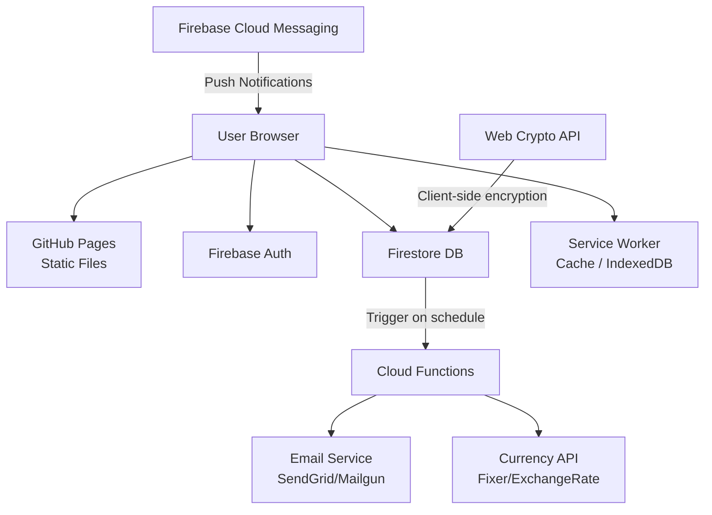

<div align="center">

# 📱 SubTracker — Subscription Management Platform

### Product Requirements Document (PRD) v1.0

**Classification:** Tool / Utility — Personal Finance  
**Model:** Free & Open Source  
**Date:** February 2026

---

</div>

## Table of Contents

- [1. Executive Summary](#1-executive-summary)
- [2. Market & Competitor Analysis](#2-market--competitor-analysis)
- [3. Problem Validation](#3-problem-validation)
- [4. Product Positioning](#4-product-positioning)
- [5. Target Users & Personas](#5-target-users--personas)
- [6. Core Features (MVP → Phase 2 → Phase 3)](#6-core-features-mvp--phase-2--phase-3)
- [7. UX/UI Direction & Design System](#7-uxui-direction--design-system)
- [8. Theme Strategy (Dark / Light / Auto)](#8-theme-strategy-dark--light--auto)
- [9. Responsive & Adaptive Design](#9-responsive--adaptive-design)
- [10. Installation & PWA Strategy](#10-installation--pwa-strategy)
- [11. Technical Stack](#11-technical-stack)
- [12. Database Justification](#12-database-justification)
- [13. System Architecture](#13-system-architecture)
- [14. API Design & Authentication](#14-api-design--authentication)
- [15. Accessibility (WCAG)](#15-accessibility-wcag)
- [16. SEO & Discoverability](#16-seo--discoverability)
- [17. Analytics & Monitoring](#17-analytics--monitoring)
- [18. CI/CD & DevOps](#18-cicd--devops)
- [19. Localization Strategy](#19-localization-strategy)
- [20. Scalability](#20-scalability)
- [21. Security](#21-security)
- [22. Error Handling & Edge Cases](#22-error-handling--edge-cases)
- [23. Monetization](#23-monetization)
- [24. Cost Estimation](#24-cost-estimation)
- [25. KPIs & Success Metrics](#25-kpis--success-metrics)
- [26. Risks & Mitigation](#26-risks--mitigation)
- [27. Roadmap (12 Months)](#27-roadmap-12-months)

---

## 1. Executive Summary

**SubTracker** is a comprehensive, free, open-source web application for managing and tracking digital subscriptions. It provides individuals and teams with a centralized dashboard to monitor recurring expenses, store login credentials securely, receive smart renewal alerts, and gain financial insights across all subscription services.

| Attribute | Details |
|-----------|---------|
| **Category** | Tool / Utility — Personal Finance & Subscription Management |
| **Target Market** | Arabic & English-speaking users (Saudi Arabia / Gulf primary, global secondary) |
| **Business Model** | 100% Free, Open Source (GitHub) |
| **Platform** | Responsive Web App + PWA (installable on all devices) |
| **Backend** | Firebase (Auth, Firestore, Cloud Functions, Cloud Messaging) |
| **Key Differentiators** | Bilingual AR/EN with full RTL, built-in password manager, team sharing, multi-currency, completely free |

---

## 2. Market & Competitor Analysis

The subscription management market has grown significantly. The average consumer manages **12+ active subscriptions** spending over **$273/month**. Research shows **42% of consumers** have forgotten about subscriptions they're paying for, and **74%** set all subscriptions to auto-pay.

### 2.1 Competitor Comparison

| Feature | Wallos | Bobby | Rocket Money | **SubTracker (Ours)** |
|---------|--------|-------|-------------|----------------------|
| **Price** | Free (self-hosted) | Free / Pro $1.99 | $7–12/mo | **Free Forever** |
| **Arabic / RTL** | ❌ | ❌ | ❌ | ✅ **Full Support** |
| **Bilingual (AR/EN)** | ❌ | ❌ | ❌ | ✅ **Yes** |
| **Password Manager** | ❌ | ❌ | ❌ | ✅ **Encrypted** |
| **Team Sharing** | ❌ | ❌ | ❌ | ✅ **Read-only** |
| **Multi-Currency** | ✅ | ✅ | ❌ USD only | ✅ **+ Auto Convert** |
| **Push Notifications** | Email/Discord | ❌ | ✅ | ✅ **Browser + Email** |
| **PWA Install** | ❌ | ❌ iOS only | ✅ Mobile | ✅ **All Platforms** |
| **Self-Hosted Required** | ✅ Yes | ❌ | ❌ | ❌ **Cloud (Firebase)** |
| **Open Source** | ✅ GPL-3 | ❌ | ❌ | ✅ **Yes** |
| **Bank Integration** | ❌ | ❌ | ✅ | ❌ Manual Entry |
| **Dark/Light Theme** | ✅ | ❌ Dark only | ✅ | ✅ **Auto + Manual** |
| **Categories** | ✅ Custom | ✅ Basic | ✅ Auto | ✅ **Custom** |
| **Export Data** | ❌ | ❌ | ❌ | ✅ **CSV + PDF** |
| **Free Trial Tracker** | ❌ | ❌ | ❌ | ✅ **Countdown + Auto-Alert** |
| **Calendar View** | ✅ Basic | ❌ | ❌ | ✅ **Hijri + Gregorian** |
| **Pause/Archive** | ❌ | ❌ | ❌ | ✅ **Freeze & Reactivate** |
| **Family Cost Split** | ❌ | ❌ | ❌ | ✅ **Per-person splitting** |
| **Email Import** | ❌ | ❌ | ✅ Auto-detect | ✅ **Gmail Scan (Phase 3)** |
| **Social Sharing** | ❌ | ❌ | ❌ | ✅ **Public Stack Pages** |
| **Subscription Marketplace** | ❌ | ❌ | ❌ | ✅ **Arabic-first discovery** |
| **Gamification** | ❌ | ❌ | ❌ | ✅ **Badges, Streaks, Score** |
| **Smart Insights / AI** | ❌ | ❌ | ❌ | ✅ **ROI, Patterns, Wrapped** |
| **Smart Alerts Engine** | ❌ | ❌ | Basic | ✅ **Proactive + AI-powered** |
| **Mini-Apps** | ❌ | ❌ | ❌ | ✅ **7 built-in mini-apps** |

### 2.2 Market Gaps & Opportunities

- **No existing subscription tracker offers Arabic/RTL interface support**
- Most competitors require payment or bank account access for full features
- No competitor combines subscription tracking with built-in password management
- Team/sharing features are absent in personal subscription trackers
- Gulf/Saudi market is completely underserved despite high subscription spending
- **No subscription tracker offers gamification** — proven to increase retention by 47%
- **No subscription marketplace exists in Arabic** for discovering and comparing services
- **No competitor provides AI-powered proactive intelligence** (price hike alerts, duplicate detection, savings tips)
- **No competitor offers "Yearly Wrapped"** — a Spotify-style annual subscription report
- **No competitor has a mini-apps ecosystem** for holistic digital subscription management

---

## 3. Problem Validation

The problem of subscription overload is well-documented and growing:

- Average household has **12 active subscriptions** but only remembers **9** of them
- **42%** of consumers pay for forgotten subscriptions (avg. **$17/month wasted**)
- **74%** of consumers auto-pay all subscriptions, reducing oversight
- **No Arabic-first solution** exists in the market
- Users tracking in spreadsheets lack automation, alerts, and mobile access
- Password reuse across services is a security risk that integrated credential storage can mitigate

---

## 4. Product Positioning

SubTracker positions itself as the **first bilingual (Arabic/English) subscription management platform** that combines expense tracking, password management, and team sharing — completely free and open source.

### Unique Value Propositions (UVPs)

1. **First-of-its-kind:** Full Arabic RTL interface with seamless language switching
2. **All-in-one:** Subscription tracking + password manager + team sharing in a single tool
3. **Zero cost:** No freemium walls, no ads, no hidden charges — forever free
4. **Privacy-first:** Client-side encryption for stored passwords, no bank account required
5. **Accessible everywhere:** PWA installable on any device from the browser
6. **Smart alerts:** Customizable notification timing via browser push and email

---

## 5. Target Users & Personas

### 👤 Persona 1: Ahmed — Young Professional (Saudi Arabia)

| | |
|---|---|
| **Age** | 26 |
| **Occupation** | Software Engineer |
| **Subscriptions** | 15+ |
| **Pain Points** | Loses track of free trials, charged for 3 forgotten services |
| **Needs** | Arabic-first tool showing exactly what he pays and when renewals are due |

### 👤 Persona 2: Sara — Freelance Designer

| | |
|---|---|
| **Age** | 30 |
| **Occupation** | Freelancer |
| **Subscriptions** | 20+ (mixed personal & business) |
| **Pain Points** | Needs to separate personal vs business, track SAR + USD |
| **Needs** | Multi-currency support, share business list with accountant |

### 👤 Persona 3: Tech Team at a Startup

| | |
|---|---|
| **Team Size** | 8 members |
| **Monthly Spend** | $2,000+ on subscriptions |
| **Pain Points** | No visibility into shared subscriptions and total costs |
| **Needs** | Centralized view of all team subscriptions with cost tracking |

---

## 6. Core Features (MVP → Phase 2 → Phase 3)

### 6.1 MVP (Phase 1) — Core Launch

| Feature | Priority | Description |
|---------|----------|-------------|
| User Authentication | **P0** | Email/password + Google Sign-In via Firebase Auth |
| Add Subscription | **P0** | Manual entry + quick-select from popular services with icons |
| Active Subscriptions List | **P0** | Card-based view with progress bars (🟢 green / 🟡 yellow / 🔴 red) |
| Dashboard Statistics | **P0** | Total cost, service count, highest/lowest, upcoming renewals |
| Bilingual Interface | **P0** | Arabic (RTL) + English (LTR) with toggle switch |
| Dark/Light Theme | **P0** | System auto-detection + manual toggle, saved preference |
| Responsive Design | **P0** | Mobile-first, works 320px to 2560px+ |
| PWA Support | **P0** | Installable, offline-capable, app-like experience |
| Multi-Currency | **P1** | User selects currency, manual input (SAR, USD, EUR, etc.) |
| Basic Notifications | **P1** | Browser push notifications for upcoming renewals |
| Subscription Categories | **P1** | Entertainment, Work, Social, Education, Other |
| Edit/Delete Subscriptions | **P0** | Full CRUD operations on subscription entries |
| Free Trial Tracker | **P0** | Mark subscription as "free trial" with countdown timer + auto-alert 1 day before trial ends. 42% of users forget to cancel trials. |
| Pause/Archive Subscription | **P1** | Freeze a subscription temporarily — data preserved but excluded from cost calculations. Reactivate with one click. |

### 6.2 Phase 2 — Enhanced Experience

| Feature | Priority | Description |
|---------|----------|-------------|
| Password Manager | **P1** | Encrypted credential storage with copy-to-clipboard |
| Email Notifications | **P1** | Email alerts before renewal dates via Firebase Cloud Functions |
| Team Sharing | **P1** | Share subscription list (read-only) via invite link |
| Currency Auto-Conversion | **P2** | Real-time exchange rates via API (Fixer/ExchangeRate) |
| Monthly Reports | **P2** | Summary of monthly spending with charts |
| Data Export | **P2** | Export subscriptions as CSV or PDF |
| Custom Notification Timing | **P1** | User sets days-before-expiry for alerts |
| Apple Sign-In | **P2** | Additional OAuth provider for iOS users |
| Calendar View (Hijri + Gregorian) | **P1** | Interactive dual-calendar (Umm al-Qura Hijri + Gregorian) showing renewal dates as colored dots, daily cost totals, and "expensive days" highlighting |
| Family/Shared Subscriptions | **P2** | Tag subscriptions as "family" or "shared with someone" with cost-splitting (e.g., Netflix Family = your share 25 SAR out of 75 SAR total) |
| Smart Social Sharing | **P2** | Generate a beautiful shareable page of your favorite tools/subscriptions — useful for developers and designers sharing their tech stack |

### 6.3 Phase 3 — Advanced Features

| Feature | Priority | Description |
|---------|----------|-------------|
| WhatsApp/SMS Notifications | **P3** | Renewal alerts via WhatsApp Business API or Twilio |
| Admin Dashboard | **P3** | User management, global stats, system health |
| Advanced Analytics | **P3** | Spending trends, year-over-year comparison, forecasting |
| Service Logo Auto-Fetch | **P3** | Automatically fetch logos from service URLs |
| Recurring Payment Insights | **P3** | AI-powered suggestions for cost optimization |
| Import from Spreadsheet | **P3** | Bulk import subscriptions from CSV/Excel |
| Multi-Language Expansion | **P3** | Additional languages beyond Arabic and English |
| Smart Email Import | **P3** | Scan confirmation emails (Gmail integration) to auto-discover subscriptions — "We found 5 subscriptions in your inbox, add them?" |
| PWA Home Screen Widget | **P3** | Quick glance widget showing: "3 subscriptions expiring this week" + total monthly cost |

### 6.4 Phase 4 — Game-Changer Features 🚀

These features transform SubTracker from a simple tracker into a **comprehensive digital subscription platform** — a category-defining product with no equivalent in the Arabic market.

| Feature | Priority | Description |
|---------|----------|-------------|
| Subscription Marketplace | **P4** | First Arabic marketplace to discover, compare, and review subscription services with exclusive deals |
| Smart Alert Engine | **P4** | AI-powered proactive alerts: price hikes, duplicate detection, savings opportunities, currency impact, weekly digest |
| Gamification System | **P4** | Streaks, badges, Subscription Score (0-100), monthly challenges, level system, personal savings goals |
| Smart Insights Engine | **P4** | Pattern analysis, lifetime cost tracking, Subscription ROI calculator, peer comparison, Yearly Wrapped report |
| Mini-Apps Platform | **P4** | Password Health Check, Expense Splitter, Google/Apple Calendar sync, Quick Links Hub, Bill Archive |

---

### 6.4 New Feature Details

#### 🧪 Free Trial Tracker

The free trial tracker addresses a critical pain point: **42% of users forget to cancel free trials**, resulting in unwanted charges.

| Aspect | Details |
|--------|---------|
| **How it works** | When adding a subscription, user selects "Free Trial" toggle |
| **Countdown Timer** | Prominent countdown displayed on the subscription card (e.g., "3 days 14 hours left") |
| **Visual Indicator** | Distinct card style with dashed border + "TRIAL" badge to differentiate from paid subscriptions |
| **Auto-Alert** | Push notification + email sent **1 day before** trial ends (non-dismissible reminder) |
| **Quick Actions** | "Cancel Now" button links directly to the service's cancellation page, "Convert to Paid" button transitions the subscription to active tracking |
| **Dashboard Integration** | Separate "Active Trials" counter on dashboard with expiring-soonest on top |

#### 📅 Calendar View (Hijri + Gregorian)

An interactive dual-calendar providing a visual overview of all renewal dates and spending patterns.

| Aspect | Details |
|--------|---------|
| **Dual Calendar** | Toggle between Umm al-Qura Hijri and Gregorian calendars (or show both side-by-side on desktop) |
| **Renewal Dots** | Color-coded dots on renewal dates: 🟢 low cost, 🟡 medium, 🔴 high cost |
| **Daily Cost Total** | Each day shows the total amount due (e.g., "Feb 15: 85 SAR") |
| **Expensive Days** | Days with high spending highlighted with a red background glow |
| **Monthly Overview** | Top bar shows: total renewals this month, total cost, comparison with last month |
| **Click to Expand** | Tap a day to see all subscriptions renewing on that date with details |
| **Navigation** | Swipe or arrow keys to navigate months, jump to today, jump to specific month |

#### ⏸️ Pause/Archive Subscription

Instead of deleting, users can temporarily freeze subscriptions while preserving all data.

| Aspect | Details |
|--------|---------|
| **Pause Action** | Swipe left on card (mobile) or click pause icon → subscription moves to "Paused" section |
| **Visual State** | Paused cards shown in grayscale with "PAUSED" overlay badge |
| **Cost Exclusion** | Paused subscriptions excluded from all dashboard calculations and cost totals |
| **Data Preserved** | All fields intact: credentials, dates, category, notes — nothing lost |
| **Reactivate** | One-tap "Reactivate" button restores to active list with recalculated dates |
| **Bulk Actions** | Select multiple subscriptions to pause/reactivate at once |
| **Auto-Pause Suggestion** | If a subscription has been unused for 30+ days (no credential access), suggest pausing it |

#### 👨‍👩‍👧‍👦 Family/Shared Subscriptions

Track shared subscription costs with accurate per-person splitting.

| Aspect | Details |
|--------|---------|
| **Subscription Type** | Tag as: "Individual", "Family Plan", or "Shared with Others" |
| **Total vs Your Share** | Input total cost AND your personal share (e.g., Total: 75 SAR, Your share: 25 SAR) |
| **Split Members** | Optionally add names of people sharing (just for reference, no accounts needed) |
| **Dashboard Impact** | Dashboard shows "Your Actual Cost" (after splitting) vs "Total Subscription Cost" |
| **Family Summary** | Dedicated view showing all family/shared subscriptions and how much you're saving through sharing |
| **Invite to SubTracker** | "Invite [person] to track their share too" — generates referral link |

#### 🔗 Smart Social Sharing

Generate beautiful, shareable pages showcasing your subscription stack.

| Aspect | Details |
|--------|---------|
| **Generate Page** | One-click generates a public, beautiful page listing your chosen subscriptions |
| **Customizable** | Choose which subscriptions to show/hide, add personal notes/reviews |
| **Design Templates** | Multiple card layouts: Grid, List, Minimal — with your name/avatar |
| **Share Links** | Direct link, Twitter/X card, LinkedIn post, copy embed code |
| **Privacy Control** | Costs, credentials, and personal data NEVER included — only service names, icons, and your notes |
| **Use Cases** | "My Developer Toolkit", "My Design Stack", "My Entertainment Setup" |
| **Community Discovery** | Browse other users' public stacks for inspiration (opt-in only) |

#### 📧 Smart Email Import (Phase 3)

Automatically discover subscriptions by scanning confirmation emails.

| Aspect | Details |
|--------|---------|
| **Gmail Integration** | Connect Gmail via OAuth (read-only access to specific labels/senders) |
| **Smart Detection** | Scan for subscription confirmation, receipt, and renewal emails |
| **AI Extraction** | Extract service name, cost, billing cycle, and start date from email content |
| **Review Before Import** | "We found 5 subscriptions — review and add" (user confirms each one) |
| **One-Time or Ongoing** | Option for one-time scan or periodic background checks for new subscriptions |
| **Privacy** | Emails processed client-side where possible; only extracted metadata stored; full email content never saved |
| **Supported Providers** | Gmail (Phase 3), Outlook (future), Yahoo (future) |

#### 📱 PWA Home Screen Widget

Quick-glance information without opening the full app.

| Aspect | Details |
|--------|---------|
| **Widget Content** | Upcoming renewals count, total monthly cost, next expiring subscription |
| **Visual Style** | Compact card matching the app's theme (dark/light) |
| **Tap Action** | Tapping the widget opens SubTracker to the relevant section |
| **Badge Notifications** | App icon badge shows count of subscriptions expiring within 3 days |
| **Implementation** | Using the Badging API + periodic background sync via Service Worker |
| **Limitation** | Full widget support varies by OS; badge notifications are the most reliable cross-platform |

---

### 6.5 Game-Changer Feature Details 🚀

#### 🌐 Subscription Marketplace — First Arabic Subscription Discovery Platform

No competitor offers a marketplace for discovering and comparing subscriptions. This makes SubTracker not just a tracker but a **destination**.

| Aspect | Details |
|--------|---------|
| **Discover Services** | Browse subscriptions by category: Entertainment, Productivity, Education, Design, Development, Gaming, Cloud Storage, Communication, Health & Fitness |
| **Price Comparison** | Side-by-side comparison: Netflix vs Shahid vs OSN+ with pricing tiers, features, and regional availability |
| **Exclusive Deals** | Partner with services for SubTracker-exclusive discounts: "20% off Canva Pro for SubTracker users" |
| **User Ratings & Reviews** | Community-driven ratings: "Netflix: 4.5⭐ — Worth it according to 230 users" with written reviews |
| **Free Alternatives** | For every paid service, suggest free alternatives: "Instead of Notion Pro, try Obsidian (free)" |
| **User-Generated Content** | Reviews, tips, best plans recommendations, "My Setup" posts |
| **Trending Section** | "Most popular subscriptions this month in Saudi Arabia" based on anonymized aggregate data |
| **Smart Recommendations** | "Based on your subscriptions, you might also like..." powered by collaborative filtering |
| **Regional Pricing** | Show Saudi/Gulf pricing specifically, with currency conversion for international services |

#### 🔔 Smart Alert Engine — Proactive Intelligence System

Transforms notifications from reactive ("your sub expires") to **proactive intelligence** that saves money.

| Alert Type | Example | Trigger |
|-----------|---------|---------|
| **Price Hike Detection** | "🔴 Adobe raised price from 230 to 260 SAR — want to find an alternative?" | Crowdsourced price change reports + web scraping |
| **Service Outage** | "Netflix is experiencing issues today — can't be used" | Integration with status page APIs (e.g., Downdetector) |
| **Savings Opportunity** | "Switch Spotify from monthly to annual and save 80 SAR/year" | Comparison of user's billing cycle vs available plans |
| **Duplicate Detection** | "You have Grammarly + ProWritingAid — two writing tools!" | AI categorization matching |
| **Currency Impact** | "USD rose — your dollar subscriptions cost 15 SAR more this month" | Exchange rate monitoring |
| **Unused Subscription** | "You haven't accessed Skillshare in 45 days — pause it?" | Last credential access or manual usage logging |
| **Trial Expiring** | "Free trial ends tomorrow — cancel now or convert?" | Trial end date countdown |
| **Weekly Digest** | "This week: 3 renewals, 245 SAR, no items need attention ✅" | Scheduled every Sunday |
| **Monthly Summary** | Full spending report with charts, comparisons, and recommendations | Scheduled 1st of each month |
| **Smart Bundling** | "Apple One bundle would save you 40 SAR vs separate Apple subscriptions" | Cross-service bundle detection |

#### 🎮 Gamification System — Financial Wellness Through Play

Gamified finance apps achieve **47% higher retention** and **50% more engagement**. This system makes saving money genuinely fun.

**🔥 Streaks System**

| Streak | Description | Reward |
|--------|-------------|--------|
| Daily Check-in | Open app daily | 🔥 Fire streak counter on profile |
| No New Subs | Days without adding a new subscription | 🏆 "Self-Control Champion" badge at 30 days |
| Budget Keeper | Days staying under monthly budget goal | 💰 "Budget Master" badge at 60 days |
| Review Streak | Days with all subscriptions reviewed/categorized | ⭐ "Organized Pro" badge at 14 days |

**🏅 Achievement Badges**

| Badge | Requirement | Rarity |
|-------|-------------|--------|
| المُوفِّر (The Saver) | Saved 500 SAR by canceling subscriptions | 🥉 Common |
| المُنظَّم (The Organizer) | All subscriptions categorized and up-to-date | 🥈 Uncommon |
| الحارس (The Guardian) | Never missed a renewal alert for 3 months | 🥇 Rare |
| المُشارك (The Sharer) | Shared your stack with 5+ people | 🥈 Uncommon |
| الخبير (The Expert) | Subscription Score above 90 for 30 days | 💎 Legendary |
| المُكتشف (The Explorer) | Tried 3 free alternatives from Marketplace | 🥉 Common |
| القائد (The Leader) | Top 10 on monthly savings leaderboard | 💎 Legendary |
| المُعلِّم (The Teacher) | Written 10+ helpful reviews in Marketplace | 🥇 Rare |

**📊 Subscription Health Score (0–100)**

| Component | Weight | Measures |
|-----------|--------|----------|
| Organization | 25% | All subs categorized, dates set, no missing info |
| Cost Efficiency | 25% | Cost vs usage, annual vs monthly optimization |
| Security | 20% | Strong passwords, no reused credentials, encrypted storage |
| Awareness | 15% | Responding to alerts, reviewing monthly reports |
| Community | 15% | Reviews written, stacks shared, badges earned |

**🏆 Monthly Challenges**

- "February Challenge: Save 200 SAR by canceling unused subscriptions"
- "March Challenge: Switch 3 subscriptions from monthly to annual billing"
- "Ramadan Challenge: Review all subscriptions and optimize for the month"
- Custom challenges: Users set their own goals and deadlines

**📈 Level System**

| Level | Name | XP Required | Perks |
|-------|------|-------------|-------|
| 1 | مبتدئ (Beginner) | 0 | Basic features |
| 2 | منظّم (Organizer) | 500 XP | Custom card colors |
| 3 | خبير (Expert) | 2,000 XP | Advanced analytics unlock |
| 4 | ماستر (Master) | 5,000 XP | Beta features access |
| 5 | أسطورة (Legend) | 10,000 XP | Community moderator privileges + special profile badge |

#### 💡 Smart Insights Engine — AI-Powered Financial Intelligence

Goes beyond numbers to deliver **actionable behavioral insights** that change how users think about subscriptions.

| Insight Type | Example | How It Works |
|-------------|---------|-------------|
| **Pattern Analysis** | "Every January you subscribe to 3 new services — do you really need them?" | Historical subscription add/cancel data analysis |
| **Lifetime Cost** | "Netflix has cost you 3,240 SAR since 2021" | startDate × monthly cost, accumulated over time |
| **Subscription ROI** | "You use Adobe CC once/week — each use costs 45 SAR. Worth it?" | Cost ÷ estimated usage frequency |
| **Peer Comparison** | "You spend 40% more on subscriptions than average for your age group" | Anonymized aggregate data from SubTracker community |
| **Category Breakdown** | "Entertainment: 55%, Productivity: 25%, Education: 10%, Other: 10%" | Automatic categorization analysis |
| **Cost Forecast** | "Based on current subscriptions, you'll spend 8,400 SAR this year" | Current monthly × 12 with price trend adjustment |
| **Optimization Tips** | "Switch to Apple One bundle and save 40 SAR/month on 3 separate Apple services" | Bundle detection algorithm |
| **Spending Velocity** | "Your subscription spending grew 23% in the last 6 months" | Month-over-month trend analysis |

**🎁 Yearly Wrapped — Your Subscription Year in Review**

Like Spotify Wrapped but for your subscriptions — a beautiful, shareable annual report:

- 💰 "In 2026, you spent **X SAR** on subscriptions"
- 📊 "Your most expensive month was **July** (vacation subscriptions!)"
- ⭐ "Your most-used service was **Netflix** (accessed 156 times)"
- 💸 "You saved **Y SAR** by canceling 4 services"
- 🏆 "You earned **12 badges** and reached **Level 3: Expert**"
- 📈 "Your Subscription Score improved from **62 → 84**"
- 🔮 "2027 Forecast: You'll spend approximately **Z SAR** if nothing changes"
- 🎨 Beautiful animated cards designed for sharing on social media
- 🌐 Generates a unique shareable link with your personalized report

#### 📱 Mini-Apps Platform — Your Digital Life Command Center

Transform SubTracker from a tracker into a **comprehensive subscription management platform**.

| Mini-App | Description | Details |
|----------|-------------|---------|
| **🔐 Password Health Check** | Analyzes stored credentials for security | "4 of your passwords are weak — update now", checks for reused passwords, suggests strong replacements, strength meter (Weak/Medium/Strong/Excellent) |
| **📊 Expense Splitter** | Calculate each person's share of shared subscriptions | Input total cost + number of people → calculates per-person share, supports uneven splits, generates shareable summary |
| **📅 Calendar Sync** | Integrate with Google Calendar / Apple Calendar | Automatically adds renewal dates as calendar events, color-coded by category, includes cost in event description, bi-directional sync |
| **🔗 Quick Links Hub** | Centralized management links for all subscriptions | One-tap access to: Cancel page, Upgrade/Downgrade page, Support contact, Account settings for each service |
| **📄 Bill Archive** | Store and organize subscription invoices | Upload receipt photos or PDFs, auto-extract amount and date via OCR, searchable archive, export for tax/accounting purposes |
| **🧮 Subscription Calculator** | "What if" scenario planning | "If I cancel X and Y, I save Z per month", drag subscriptions to simulate changes, compare current vs proposed budget |
| **📋 Subscription Checklist** | Onboarding checklist for new subscriptions | When adding a new sub: "Did you set a reminder? Save the password? Check the cancellation policy?", ensures no details are missed |

---

## 7. UX/UI Direction & Design System

### 7.1 Design Philosophy

SubTracker follows a **card-based, clean design language** inspired by modern fintech applications. The design prioritizes clarity, scannability, and minimal cognitive load. Every interaction should feel smooth with purposeful micro-animations. The interface must feel equally polished and natural in both **Arabic (RTL)** and **English (LTR)** modes.

### 7.2 Design Tokens — Color Palette

| Token | Light Mode | Dark Mode |
|-------|-----------|-----------|
| `--color-primary` | `#1B4F72` | `#3498DB` |
| `--color-secondary` | `#2E86C1` | `#5DADE2` |
| `--color-background` | `#F8F9FA` | `#121212` |
| `--color-surface` | `#FFFFFF` | `#1E1E1E` |
| `--color-surface-hover` | `#F2F4F4` | `#2C2C2C` |
| `--color-text-primary` | `#1C2833` | `#ECEFF1` |
| `--color-text-secondary` | `#5D6D7E` | `#90A4AE` |
| `--color-border` | `#D5DBDB` | `#333333` |
| `--color-accent` | `#3498DB` | `#64B5F6` |
| `--color-success` | `#27AE60` | `#66BB6A` |
| `--color-warning` | `#F39C12` | `#FFA726` |
| `--color-danger` | `#E74C3C` | `#EF5350` |
| `--color-card-shadow` | `rgba(0,0,0,0.08)` | `rgba(0,0,0,0.3)` |

### 7.3 Typography

| Usage | Font | Size |
|-------|------|------|
| **English** | Inter (Google Fonts) | — |
| **Arabic** | IBM Plex Sans Arabic / Noto Sans Arabic | — |
| Headings | — | 24px–32px `clamp(1.5rem, 2vw, 2rem)` |
| Body | — | 14px–16px `clamp(0.875rem, 1.2vw, 1rem)` |
| Captions | — | 12px–14px |
| Line Height | Body: 1.5, Headings: 1.3 | — |

### 7.4 Component Library

- **Cards:** Subscription cards with icon, name, progress bar, cost, days remaining
- **Buttons:** Primary (filled), Secondary (outlined), Ghost (text-only), Danger (red)
- **Inputs:** Floating labels, validation states, RTL-aware placeholders
- **Modals:** Add/Edit subscription dialogs with smooth slide-up animation
- **Progress Bars:** Gradient color transition (green → yellow → red) based on days remaining
- **Navigation:** Bottom tab bar (mobile) / Sidebar (desktop)
- **Toasts:** Success/Error/Info notifications with auto-dismiss

### 7.5 Micro-Animations & Interactions

| Interaction | Animation |
|-------------|-----------|
| Page transitions | Fade + slight slide (200ms ease-out) |
| Card hover | Subtle lift with shadow increase `translateY(-2px)` |
| Progress bar | Animated fill on page load (CSS transition 600ms) |
| Theme toggle | Smooth color transition (300ms) with no flash |
| Language switch | Layout flip animation (200ms) for RTL/LTR |
| Button press | Scale down 0.97 + ripple effect |
| Modal | Backdrop fade + content slide-up (250ms) |

### 7.6 Empty, Loading & Error States

| State | Implementation |
|-------|---------------|
| **Empty** | Illustrated placeholder + "Add your first subscription" CTA button |
| **Loading** | Skeleton cards with shimmer animation (no spinners) |
| **Error** | Friendly error illustration + retry button + descriptive message |
| **Offline** | Banner notification + cached data display + sync indicator |

---

## 8. Theme Strategy (Dark / Light / Auto)

### 8.1 Technical Approach

**CSS Custom Properties (CSS Variables)** — chosen for best balance of performance, simplicity, and browser support for a vanilla HTML/CSS/JS project.

### 8.2 Implementation Details

- All colors defined as CSS variables on `:root` (light) and `[data-theme="dark"]` (dark)
- System preference detection via `prefers-color-scheme` media query on initial load
- User preference saved to `localStorage` AND synced to Firebase user profile
- Smooth transition on toggle:
  ```css
  * { transition: background-color 300ms, color 300ms, border-color 300ms; }
  ```
- **Flash prevention:** Theme applied in `<head>` blocking script before DOM render
- **WCAG AA** contrast ratios ensured: minimum 4.5:1 for text, 3:1 for large text in both modes
- Images/icons: SVG icons use `currentColor` for automatic theme adaptation
- System elements: Custom scrollbar styles, selection colors, form control theming per mode
- All components tested in both modes across all breakpoints

---

## 9. Responsive & Adaptive Design

### 9.1 Breakpoints

| Breakpoint | Width | Layout | Target |
|-----------|-------|--------|--------|
| **xs** (Mobile S) | 320px–479px | 1 column, bottom nav | Small phones |
| **sm** (Mobile L) | 480px–767px | 1 column, bottom nav | Large phones |
| **md** (Tablet) | 768px–1023px | 2 columns, sidebar | Tablets |
| **lg** (Desktop) | 1024px–1439px | 3 columns, sidebar | Laptops |
| **xl** (Large) | 1440px–2559px | 3–4 columns, sidebar | Monitors |
| **2xl** (Ultra) | 2560px+ | Max-width container, 4 col | Ultra-wide |

### 9.2 Key Strategies

- **Mobile-First:** Base CSS targets mobile, `@media (min-width)` for larger screens
- **Fluid Typography:** `clamp()` for font sizes, `rem`/`em` units throughout
- **Flexible Grid:** CSS Grid for page layout, Flexbox for component internals
- **Touch-Friendly:** Minimum 44×44px touch targets, adequate spacing
- **RTL Support:** CSS logical properties (`margin-inline-start`, `padding-inline-end`) instead of left/right
- **Container-aware:** Components adapt based on container size, not just viewport
- **Performance:** Lazy-load images, code-split per route, optimized assets per breakpoint

---

## 10. Installation & PWA Strategy

| Aspect | Implementation |
|--------|---------------|
| **Manifest** | Full `manifest.json` with icons (192px, 512px, maskable), theme colors, `display: standalone` |
| **Service Worker** | Workbox-based: stale-while-revalidate for API, cache-first for static assets |
| **Install Prompt** | Custom in-app banner after 2nd visit, dismissible, OS-aware instructions |
| **Offline Support** | App shell cached, subscription data in IndexedDB, sync when online |
| **Push Notifications** | Firebase Cloud Messaging (FCM), user opt-in flow |
| **App Updates** | SW update detection → "New version available" toast with refresh button |
| **Splash Screen** | Custom splash with SubTracker logo, matches theme preference |

---

## 11. Technical Stack

| Layer | Technology | Justification |
|-------|-----------|---------------|
| **Frontend** | HTML5 + CSS3 + Vanilla JS (ES6+) | No framework overhead, fastest load, simplest GitHub Pages deploy. Ideal for solo developer. |
| **CSS Architecture** | CSS Custom Properties + BEM | Native theming, no build step, excellent browser support |
| **Animations** | CSS Transitions + Keyframes | Hardware-accelerated, no library, smooth 60fps |
| **Authentication** | Firebase Authentication | Email/password + Google OAuth. Free tier: 10K MAU |
| **Database** | Firebase Cloud Firestore | NoSQL, real-time sync, offline persistence, security rules. Free: 50K reads/20K writes per day |
| **Cloud Functions** | Firebase Cloud Functions (Node.js) | Serverless: email notifications, scheduled tasks, currency API proxy |
| **Push Notifications** | Firebase Cloud Messaging (FCM) | Free, cross-browser push, integrates with service worker |
| **Hosting** | GitHub Pages + Firebase Hosting | GitHub Pages for static frontend (free), Firebase for Cloud Functions |
| **Password Encryption** | Web Crypto API (AES-256-GCM) | Native browser encryption, PBKDF2 key derivation from user password |
| **Icons** | SVG sprite + service logos | Crisp at any resolution, themeable via CSS |
| **i18n** | Custom module (JSON files) | Lightweight, no library needed. JSON for AR/EN |
| **PWA** | Service Worker + Workbox | Offline caching, background sync, push handling |
| **Charts** | Chart.js (CDN) | Lightweight, responsive, RTL support, beautiful defaults |

> **Why no framework?** This stack requires no build tools (Webpack, Vite), no package managers at runtime, and deploys as static files to GitHub Pages. Firebase handles all backend needs without a custom server.

---

## 12. Database Justification

### 12.1 Comparison

| Criteria | Firestore | Supabase | PlanetScale | MongoDB Atlas |
|----------|-----------|----------|-------------|---------------|
| **Free Tier** | 50K reads/day | 500MB, 50K rows | 5GB, 1B reads | 512MB |
| **Real-time Sync** | ✅ Native | ✅ Native | ❌ | ❌ Change Streams |
| **Offline Support** | ✅ Built-in | ❌ | ❌ | ❌ |
| **Auth Integration** | ✅ Firebase Auth | ✅ Supabase Auth | ❌ External | ❌ External |
| **Security Rules** | ✅ Declarative | ✅ Row Level | ❌ App-level | ❌ App-level |
| **Hosting Bundle** | ✅ All-in-one | ✅ All-in-one | ❌ DB only | ❌ DB only |
| **Learning Curve** | Low | Medium | High (SQL) | Medium |
| **No Server Needed** | ✅ | ✅ | ❌ Need API | ❌ Need API |

> **Winner: Firebase Firestore** — bundles auth, database, real-time sync, offline persistence, hosting, and cloud functions with a generous free tier. Eliminates the need for a separate backend server.

### 12.2 Firestore Schema

```
users/{userId}
├── Profile: name, email, language, theme, currency, notificationPreferences
├── subscriptions/{subscriptionId}
│   ├── name, url, amount, currency
│   ├── startDate, duration, durationType
│   ├── category, username, encryptedPassword
│   ├── isActive, createdAt, updatedAt
│   ├── notifyDaysBefore
│   ├── isTrial (boolean) — marks as free trial
│   ├── trialEndDate — auto-alert triggers 1 day before
│   ├── status: "active" | "paused" | "expired" | "trial"
│   ├── pausedAt — timestamp when paused
│   ├── subscriptionType: "individual" | "family" | "shared"
│   ├── totalCost — full cost before splitting
│   ├── yourShare — user's portion of the cost
│   ├── sharedWith: ["Name1", "Name2"] — reference names
│   ├── priceHistory: [{date, amount}] — track price changes
│   └── usageLog: [{date, action}] — for ROI calculation
├── sharedWith/{shareId}
│   ├── sharedByUserId, permissions: "read-only", createdAt
├── publicStacks/{stackId}
│   ├── title, subscriptionIds, template, isPublic, createdAt
├── gamification/
│   ├── xp, level, currentStreak, longestStreak
│   ├── badges: [{id, earnedAt, name}]
│   ├── subscriptionScore: {total, breakdown: {organization, cost, security, awareness, community}}
│   ├── challenges: [{id, name, target, progress, startDate, endDate}]
│   └── monthlyStats: [{month, xpEarned, badgesEarned, savings}]
├── insights/
│   ├── yearlyWrapped/{year}: {totalSpent, topService, savedAmount, badges, scoreProgress}
│   ├── patterns: [{type, description, detectedAt}]
│   └── recommendations: [{type, message, potential_savings, createdAt}]
├── alerts/{alertId}
│   ├── type: "price_hike" | "duplicate" | "savings" | "currency" | "unused" | "outage"
│   ├── message, isRead, createdAt, relatedSubscriptionId
│   └── actionTaken: "dismissed" | "acted" | null
└── bills/{billId}
    ├── subscriptionId, imageUrl, amount, date, ocrExtracted

marketplace/ (global collection)
├── services/{serviceId}
│   ├── name, logo, category, website
│   ├── plans: [{name, price, currency, billingCycle, features}]
│   ├── alternatives: [serviceIds]
│   ├── avgRating, reviewCount
│   └── deals: [{title, discount, code, expiresAt, subTrackerExclusive}]
├── reviews/{reviewId}
│   ├── userId, serviceId, rating, text, helpful_count, createdAt
└── trending/
    ├── region, topServices, period
```

---

## 13. System Architecture

### Architecture Pattern

**Client-heavy Jamstack with Firebase BaaS (Backend-as-a-Service)**

### Data Flow



### Flow Description

1. User interacts with **HTML/CSS/JS frontend** (static files on GitHub Pages)
2. **Firebase Auth** handles all authentication flows (email, Google OAuth)
3. **Firestore SDK** on client reads/writes subscription data with security rules
4. **Cloud Functions** handle: scheduled notification checks, email sending, currency rate fetching
5. **FCM** delivers push notifications to the browser
6. **Service Worker** caches app shell and subscription data for offline access
7. **Web Crypto API** encrypts/decrypts passwords client-side (never sent unencrypted)

---

## 14. API Design & Authentication

Since SubTracker uses Firebase as a BaaS, there is no traditional REST/GraphQL API. The Firestore SDK communicates directly from the client to the database, secured by Firestore Security Rules.

### 14.1 Authentication Strategy

- Firebase Authentication with **JWT tokens** (managed automatically by Firebase SDK)
- Providers: **Email/Password + Google Sign-In** (Phase 1), **Apple Sign-In** (Phase 2)
- Session persistence: `LOCAL` (survives browser restart)
- Security Rules enforce that users can only read/write their own data

### 14.2 Firestore Security Rules

```javascript
rules_version = '2';
service cloud.firestore {
  match /databases/{database}/documents {
    // User profile
    match /users/{userId} {
      allow read, write: if request.auth != null && request.auth.uid == userId;
      
      // User's subscriptions
      match /subscriptions/{subId} {
        allow read, write: if request.auth != null && request.auth.uid == userId;
      }
      
      // Shared access
      match /sharedWith/{shareId} {
        allow read: if request.auth != null;
        allow write: if request.auth != null && request.auth.uid == userId;
      }
    }
  }
}
```

---

## 15. Accessibility (WCAG)

| Requirement | Implementation |
|-------------|---------------|
| **Target** | WCAG 2.1 AA compliance |
| **Contrast** | Minimum 4.5:1 for normal text, 3:1 for large text (both themes) |
| **Keyboard** | Full tab order, visible focus indicators, Escape to close modals |
| **Screen Readers** | Semantic HTML5 (`nav`, `main`, `section`), ARIA labels, live regions |
| **Focus Management** | Focus trap in modals, focus return after close |
| **Reduced Motion** | `prefers-reduced-motion: reduce` disables animations |
| **Touch Targets** | Minimum 44×44px for all interactive elements |
| **Language** | `lang` attribute switches between `ar` and `en` on `<html>` |
| **Color** | Never use color alone — progress bars have numeric labels too |

---

## 16. SEO & Discoverability

- **Static HTML:** Naturally SEO-friendly, no SSR needed
- **Meta Tags:** `title`, `description`, `og:image`, `twitter:card` for social sharing
- **Structured Data:** JSON-LD `WebApplication` schema markup
- **Core Web Vitals:** LCP < 2.5s, FID < 100ms, CLS < 0.1
- **Sitemap.xml:** Auto-generated for public pages
- **Robots.txt:** Allow all public pages, block user data routes
- **Hreflang:** Arabic and English versions with proper alternate links
- **Performance:** Optimized images (WebP), minified CSS/JS, preloaded critical fonts

---

## 17. Analytics & Monitoring

| Purpose | Tool | Details |
|---------|------|---------|
| User Analytics | **GA4** | Page views, user flows, retention, events (free) |
| Error Tracking | **Sentry** (Free tier) | JS errors, stack traces, breadcrumbs |
| Performance | **Lighthouse CI + Web Vitals** | Automated audits on deploy, real-user metrics |
| Uptime | **UptimeRobot** (Free) | 5-min checks, email alerts on downtime |
| Firebase | **Firebase Analytics** | Built-in: auth events, Firestore usage, FCM delivery |

---

## 18. CI/CD & DevOps

### 18.1 Git Branching Strategy

```
main ────────────────────────── Production (GitHub Pages)
  └── develop ───────────────── Integration branch
        ├── feature/auth ─────── Feature branches
        ├── feature/dark-mode
        └── feature/dashboard
  └── hotfix/* ──────────────── Emergency production fixes
```

### 18.2 Deployment Pipeline

```
Push to main → GitHub Actions:
  ├── 1. Lint CSS/JS (Stylelint + ESLint)
  ├── 2. Run tests (if applicable)
  ├── 3. Minify assets (CSS/JS)
  └── 4. Deploy to GitHub Pages

Firebase Cloud Functions:
  └── firebase deploy --only functions (separate pipeline)
```

### 18.3 Environments

| Environment | Branch | Firebase Project | URL |
|-------------|--------|-----------------|-----|
| Development | `develop` | subtracker-dev | localhost:5000 |
| Staging | `develop` | subtracker-staging | staging.subtracker.app |
| Production | `main` | subtracker-prod | subtracker.app |

---

## 19. Localization Strategy

### 19.1 i18n Implementation

- **Custom lightweight i18n module** — no library dependency
- Translation files: `/locales/ar.json` and `/locales/en.json`
- Key-based lookup: `data-i18n` attributes on HTML elements
- Dynamic content: `i18n.t('key')` function for JS-generated content
- Instant language switch without page reload
- Preference saved to `localStorage` and Firebase user profile

### 19.2 RTL/LTR Strategy

- HTML `dir` attribute switches between `rtl` and `ltr` on `<html>`
- CSS logical properties: `margin-inline-start`, `padding-inline-end` (not left/right)
- Flexbox/Grid direction auto-adapts with `dir` attribute
- Direction-implying icons (arrows, progress) are mirrored in RTL
- Calendar and date displays respect locale formatting
- Number formatting: Configurable between Arabic-Indic and Western numerals

### 19.3 Translation Example

```json
// locales/en.json
{
  "nav.home": "Home",
  "nav.dashboard": "Dashboard",
  "subscription.add": "Add Subscription",
  "subscription.name": "Service Name",
  "subscription.remaining": "{{days}} days remaining",
  "dashboard.total_cost": "Total Monthly Cost",
  "theme.dark": "Dark Mode",
  "theme.light": "Light Mode"
}

// locales/ar.json
{
  "nav.home": "الرئيسية",
  "nav.dashboard": "لوحة التحكم",
  "subscription.add": "إضافة اشتراك",
  "subscription.name": "اسم الخدمة",
  "subscription.remaining": "{{days}} يوم متبقي",
  "dashboard.total_cost": "إجمالي التكلفة الشهرية",
  "theme.dark": "الوضع الداكن",
  "theme.light": "الوضع الفاتح"
}
```

---

## 20. Scalability

- **Firebase auto-scales:** Firestore, Auth, Cloud Functions, and FCM all scale automatically
- **Static frontend:** GitHub Pages serves unlimited traffic via CDN
- **Firestore indexes:** Composite indexes for common queries (`userId` + `isActive` + `expiryDate`)
- **Cloud Functions:** Auto-scaling with minimum instances set to 0 (cost-efficient)
- **Client-side caching:** Service Worker + IndexedDB reduces repeated database reads
- **If scale exceeds free tier:** Migrate to Firebase Blaze (pay-as-you-go) with budget alerts

---

## 21. Security

| Threat | Mitigation |
|--------|-----------|
| **Unauthorized Data Access** | Firestore Security Rules: users can only access their own documents |
| **Password Storage** | Client-side AES-256-GCM encryption via Web Crypto API. Master key from PBKDF2. Encrypted blob in Firestore; Firebase never sees plaintext. |
| **XSS** | Input sanitization, CSP headers, no `innerHTML` with user data |
| **CSRF** | Firebase Auth uses httpOnly cookies and SameSite attributes |
| **Brute Force** | Firebase Auth built-in rate limiting + account lockout |
| **Data in Transit** | HTTPS enforced on GitHub Pages and Firebase Hosting |
| **Dependencies** | No npm runtime deps in frontend. CDN scripts use SRI (Subresource Integrity) |
| **API Key Exposure** | Firebase API keys are safe to expose (restricted by security rules). Domain restrictions applied. |

### Password Encryption Flow

```
User enters password for a subscription
    ↓
Web Crypto API: PBKDF2 derives encryption key from user's master password
    ↓
AES-256-GCM encrypts the subscription password
    ↓
Encrypted blob + IV + salt stored in Firestore
    ↓
On read: User's master password → PBKDF2 → decrypt → display
    ↓
Plaintext NEVER leaves the browser, NEVER stored in Firebase
```

---

## 22. Error Handling & Edge Cases

| Scenario | Handling |
|----------|---------|
| **Network Errors** | Graceful fallback to cached data with "Offline" banner, auto-retry on reconnection |
| **Auth Errors** | Clear messages for wrong password, account exists, network issues. Redirect to login on token expiry |
| **Firestore Errors** | Retry logic with exponential backoff for transient failures |
| **Form Validation** | Real-time inline validation with accessible error messages |
| **Empty States** | Illustrated placeholders guiding users to take action |
| **Rate Limits** | Client-side debouncing on rapid inputs to prevent Firestore quota hits |
| **Corrupt Data** | Schema validation on reads, fallback to defaults for missing fields |
| **Browser Compat** | Feature detection + polyfills for Web Crypto API and Service Worker |

---

## 23. Monetization

**SubTracker is and will remain 100% free** with no monetization.

The project is open-source and community-driven. There are no ads, no premium tiers, no data selling, and no sponsored features.

**Cost sustainability** is achieved through:
- Firebase free tier (generous for this scale)
- GitHub Pages (free hosting)
- Personal development time
- Community contributions

---

## 24. Cost Estimation

### 24.1 Development Timeline

| Phase | Duration | Scope |
|-------|----------|-------|
| **Phase 1 (MVP)** | 6–8 weeks | Core auth, CRUD, dashboard, bilingual, PWA, theming |
| **Phase 2 (Enhanced)** | 4–6 weeks | Password manager, email notifications, sharing, export |
| **Phase 3 (Advanced)** | 4–6 weeks | WhatsApp alerts, admin panel, analytics, calendar |

### 24.2 Monthly Operating Cost

| Service | Free Tier Limit | Monthly Cost |
|---------|----------------|-------------|
| Firebase Auth | 10K MAU | **$0** |
| Firestore | 50K reads + 20K writes/day | **$0** |
| Cloud Functions | 2M invocations/month | **$0** |
| Firebase Hosting | 10 GB transfer/month | **$0** |
| GitHub Pages | 100 GB bandwidth/month | **$0** |
| UptimeRobot | 50 monitors | **$0** |
| Sentry | 5K errors/month | **$0** |
| Custom Domain | 1 domain | **~$12/year** |
| **Total** | — | **$0–$1/month** |

---

## 25. KPIs & Success Metrics

| KPI | Month 3 | Month 6 | Month 12 |
|-----|---------|---------|----------|
| Registered Users | 100 | 500 | 2,000 |
| Monthly Active Users | 50 | 200 | 800 |
| Avg Subscriptions/User | 5 | 7 | 10 |
| PWA Install Rate | 10% | 20% | 30% |
| Notification Opt-in | 30% | 50% | 60% |
| GitHub Stars | 10 | 50 | 200 |
| Page Load Time (LCP) | < 2.5s | < 2.0s | < 1.5s |
| Error Rate | < 1% | < 0.5% | < 0.3% |

---

## 26. Risks & Mitigation

| Risk | Impact | Probability | Mitigation |
|------|--------|-------------|-----------|
| Firebase free tier exceeded | High | Low | Monitor usage with alerts; Blaze plan is pay-as-you-go with budget caps |
| Solo developer burnout | High | Medium | Phased development; MVP-first; open source for community help |
| Security breach (passwords) | Critical | Low | Client-side encryption; Firebase rules; no plaintext; security audit |
| Low adoption | Medium | Medium | Focus on Arabic market gap; Saudi tech communities; ProductHunt launch |
| Firebase pricing changes | Medium | Low | Architecture allows Supabase migration; data export for portability |
| Browser compatibility | Medium | Low | Progressive enhancement; feature detection; cross-browser testing |
| RTL layout bugs | Medium | Medium | Dedicated RTL testing; CSS logical properties; visual regression tests |

---

## 27. Roadmap (18 Months)

```
Month  1-2  ┃ Phase 1A ┃ Project setup, Firebase config, auth, UI shell, i18n framework
Month  3-4  ┃ Phase 1B ┃ Subscription CRUD, dashboard stats, progress bars, theme, responsive
             ┃          ┃ + Free Trial Tracker with countdown & auto-alerts
             ┃          ┃ + Pause/Archive subscription functionality
Month  5-6  ┃ Phase 1C ┃ PWA setup, push notifications, categories, multi-currency → MVP Launch 🚀
Month  7-8  ┃ Phase 2A ┃ Password manager (encrypted), email notifications, custom alert timing
             ┃          ┃ + Calendar View (Hijri + Gregorian dual calendar)
             ┃          ┃ + Family/Shared subscription cost splitting
Month  9-10 ┃ Phase 2B ┃ Team sharing, data export (CSV/PDF), monthly reports with charts
             ┃          ┃ + Smart Social Sharing (generate public tool stack pages)
Month 11-12 ┃ Phase 3  ┃ Admin dashboard, WhatsApp notifications, logo auto-fetch
             ┃          ┃ + Smart Email Import (Gmail scan for subscriptions)
             ┃          ┃ + PWA Widget (badge notifications, quick-glance info)
Month 13-15 ┃ Phase 4A ┃ 🚀 GAME-CHANGERS: Smart Alert Engine (proactive AI intelligence)
             ┃          ┃ + Gamification System (streaks, badges, score 0-100, levels, challenges)
             ┃          ┃ + Smart Insights Engine (patterns, lifetime cost, ROI, peer comparison)
             ┃          ┃ + Yearly Wrapped (Spotify-style annual subscription report)
Month 16-18 ┃ Phase 4B ┃ 🚀 Subscription Marketplace (discover, compare, review, exclusive deals)
             ┃          ┃ + Mini-Apps Platform (Password Health, Calendar Sync, Bill Archive,
             ┃          ┃   Quick Links Hub, Expense Splitter, Subscription Calculator)
             ┃          ┃ + Community features + Leaderboards + full platform maturity
```

---

<div align="center">

### 🚀 SubTracker — Track Every Subscription, Save Every Riyal

**Free Forever · Open Source · Built for the Arabic Web**

[GitHub](https://github.com/F2lcon01/subscriptionsAI) · [Report Bug](https://github.com/F2lcon01/subscriptionsAI/issues) · [Request Feature](https://github.com/F2lcon01/subscriptionsAI/issues)

</div>
